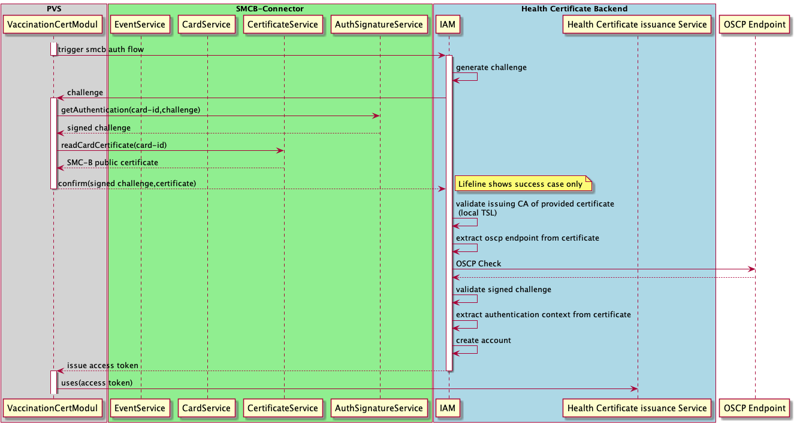

# Authentication Flow 

In order to authenticate with a TI SMCB we're leveraging a challenge response procedure integrated into an oidc flow.
The following diagram illustrates this flow



# Official Endpoints

| Environment | Endpoint | Details |
| --- | --- | --- |
| TI Referenz Umgebung  (RU) | https://id.ru.impfnachweis.info/auth/realms/ubirch-certify/protocol/openid-connect/auth |  [Release 2.1.0](https://github.com/Digitaler-Impfnachweis/certification-apis/tree/2.1.0) deployed |
| TI Produktions Umgebung (PU) | https://id.impfnachweis.info/auth/realms/bmg-ti-certify/protocol/openid-connect/auth |  [Release 2.0.0](https://github.com/Digitaler-Impfnachweis/certification-apis/tree/2.0.0) in rollout |

Access to a simplified test environment available in the internet is documented [here](https://github.com/Digitaler-Impfnachweis/certification-apis/discussions/14).

# Authentication flow

## 1. Trigger smcb authentication flow

OIDC Authorization Endpoint: `https://<host>/auth/realms/<realm>/protocol/openid-connect/auth`

| Query-Param | Value | Description |
| --- | --- | --- |
| client_id  | `user-access-ti` or `user-access-ti-simulator` | `user-access-ti` requires a RU SMCB . `user-access-ti-kops-simulator` can be used in conjuction with the gematik KOPS. [Further Details](https://github.com/Digitaler-Impfnachweis/certification-apis/discussions/14) |
| redirect_uri | connector://authenticated | custom-uri scheme |
| response_type  | code |  |
| scope | openid | |
| nonce | <random-value> | |

Triggering of this call results in redirect which contains details for the next step. 

Example Request
```
curl --request GET 'https://<host>/auth/realms/<realm>/protocol/openid-connect/auth?redirect_uri=connector://authenticated&response_type=code&scope=openid&client_id=user-access-ti&nonce=<random-value>' -v
```
Example Response 
```
< HTTP/2 303
< content-length: 0
< location: https://<host>/auth/realms/<realm>/login-actions/authenticate?session_code=kNJIzxgdw6GWYHdNIeI5aEA7x91b8-tuw0zdVHGMabE&execution=ab86f06d-69b0-44d3-8c7b-a980ed1dc3a7&client_id=user-access-ti&tab_id=WGEj4oBWvh4&auth_session_id=ce6ed41d-b46d-4a69-9ef7-ef5ab7ad63c0
< x-auth-challenge: 171c09de-2f1a-493a-bad7-ee4761a2bec3
```

## 2. Receive Challenge 

Response of step 1 contains the following header parameters:

| Header | Value | Description |
| --- | --- | --- |
| x-auth-challenge  | ... | Challenge in form of a UUID |
| Location  | <action-uri> | URI |

Both parameters are important and need to be saved temporary since they're relevant for step 4.

## 3. Perform Signature operation with SMCB

This step takes care of signing the provided challenge with the SMCB. The steps are not illustrated here because there are dependent on the framework of the integrating system. Details about the interaction with the SMCB can be seen in the [sequence diagram](authentication/seq_diagram_smcb_iam.png).

The signature is created based on the provided challenge and must be hashed with `SHA-256`.

**Supported Ciphers:** RSA and ECC

**Signature Scheme:** RSASSA-PSS 

**SMC-B Certificate Requirements**

| OID | Value | Description |
| --- | --- | --- |
| Policy  | 1.2.276.0.76.4.77 | "OID-Festlegung Zertifikatstyp" |
| ProfessionOID  | 1.2.276.0.76.4.50 | "Betriebsstätte Arzt" |

Test environments are not limited in respect to the `ProfessionOID`.

## 4. Submit Signed challenge and SMCB public certificate

Call action-uri from step 2 and add the following request headers 

| Header | Value | Description |
| --- | --- | --- |
| x-auth-signed-challenge  | ... | the signed challenge as base64 encoded string |
| x-auth-certificate  | ... | the public certificate of the smcb as base64 encoded string |

```
curl --location -viks --request GET 'https://<host>/auth/realms/<realm>/login-actions/authenticate?client_id=user-access-ti&execution=ab86f06d-69b0-44d3-8c7b-a980ed1dc3a7&session_code=xidVii9ba-WI2pLuVGA6VxKZRhCs6NmtbrwYFFaeh2k&tab_id=BpjQ0_H_Mvk&auth_session_id=0a4d8e20-3ed5-4af2-97bb-c7d16b7c7e00' \
--header 'x-auth-signed-challenge: WX/kLxPnAlhBOyvXAiCCgul2U07xJ+kiFCz9CHp3/gLGpOA7sSWgJVB/rY6MHve4mtqBhlvgwPfdfTc3ubPLK8I0GLCGTbsbwCBvm+FkC+OxN+5VkNp7Azwxhol7hWjEeTFj1C3raA5p6jBZ3FZMugySPXcKkSzpew8JzeVElDBdfl7z0drmBsVyDF2Cu9HOt1TU0qAqXgdf2Yhs+hvAme9J9iurfjOziUoGBNDR5FX2MQfAPToWVXuImrdmNqOJMHnT6eDk9hHQJeikVNwimMk2aB0FAz/U7B79XVnkAluWeRQ2F6R135gF4M2MXZy/floCljYisuzkrfU3uLB2wA==' \
--header 'x-auth-certificate: MIIHMzCCBhugAwIBAgICVnAwDQYJKoZIhvcNAQELBQAwgbYxCzAJBgNVBAYTAkRFMTowOAYDVQQKDDFULVN5c3RlbXMgSW50ZXJuYXRpb25hbCBHbWJIIC0gRzIgTG9zIDMgTk9ULVZBTElEMUgwRgYDVQQLDD9JbnN0aXR1dGlvbiBkZXMgR2VzdW5kaGVpdHN3ZXNlbnMtQ0EgZGVyIFRlbGVtYXRpa2luZnJhc3RydWt0dXIxITAfBgNVBAMMGFRTWVNJLlNNQ0ItQ0ExIFRFU1QtT05MWTAeFw0xNjEyMTQwNzM2MThaFw0yMTEyMTQyMzU5NTlaMHExCzAJBgNVBAYTAkRFMRcwFQYDVQQKDA5LWkJWIE5PVC1WQUxJRDEgMB4GA1UEBRMXMTIuODAyNzY4ODMxMTAwMDAwMTgxNjYxJzAlBgNVBAMMHkRyLiBTb3BoaWUgR8O2cmxpdHplclRFU1QtT05MWTCCASMwDQYJKoZIhvcNAQEBBQADggEQADCCAQsCggEBAIPYOVMEsaSDRrSPRiGql6z1K+PZhCzBPhqnROU4KR+45deY2yA+mtqhRmyhhWIFlGZqR813TJEfXq33osyktSiMvQRbICjFaHy38WMw3GG19Sz1jMPOEjdBmnNkgD4vjovcsZzfUPERW914MI3w3g/vQGLs0f91rCxq6lEw/KtFr0GsnsK+ZTpA5e9n9ULaQPqN/Q22BGhSoRsjWTotRH2HoRoE3FKM8RPOsJXiRKtGSJLiQxdrLWntBUElMbjpLLWXo2rWiAe2w/Cvz45PXWsiy8wirbIxvxm+HdW7FUrzE74Gh79HiPCL5g6gb9Rhdu8GyExJ5n3b+f70FzlH4MkCBEAAAIGjggOMMIIDiDAfBgNVHSMEGDAWgBSrVMi8OC5HcosnFo8PRDMzdN2QYDAdBgNVHQ4EFgQUlogy0lXlcxm/aBofSwkf+33/JE0wDgYDVR0PAQH/BAQDAgWgMHIGA1UdIARrMGkwUAYIKoIUAEwEgSMwRDBCBggrBgEFBQcCARY2aHR0cDovL3d3dy5oYmEtdGVzdC50ZWxlc2VjLmRlL3BvbGljaWVzL0VFX3BvbGljeS5odG1sMAkGByqCFABMBE0wCgYIKoIUAEwEgSowDAYDVR0TAQH/BAIwADCCAbAGA1UdHwSCAacwggGjMIG6oIG3oIG0hoGxbGRhcDovL2xkYXAtaGJhLXRlc3QudGVsZXNlYy5kZS9DTj1ULVN5c3RlbXMlMjBTTUMlMjBUZXN0LUNBJTIwMSxPVT1UcnVzdCUyMENlbnRlciUyMERldXRzY2hlJTIwVGVsZWtvbSxPPVQtU3lzdGVtcyUyMEVudGVycHJpc2UlMjBTZXJ2aWNlcyUyMEdtYkgsQz1ERT9DZXJ0aWZpY2F0ZVJldm9jYXRpb25MaXN0MIHjoIHgoIHdhoHaaHR0cDovL2hiYS10ZXN0LnRlbGVzZWMuZGUvaGJhL2Rvd25sb2FkL2Rvd25sb2FkLmNybD9wYXRoPUNOJTNEVC1TeXN0ZW1zJTIwU01DJTIwVGVzdC1DQSUyMDElMkNPVSUzRFRydXN0JTIwQ2VudGVyJTIwRGV1dHNjaGUlMjBUZWxla29tJTJDTyUzRFQtU3lzdGVtcyUyMEVudGVycHJpc2UlMjBTZXJ2aWNlcyUyMEdtYkglMkNDJTNEREUlM0ZDZXJ0ZmljYXRlUmV2b2NhdGlvbkxpc3QwgaYGBSskCAMDBIGcMIGZpB4wHDELMAkGA1UEBhMCREUxDTALBgNVBAoMBEtaQlYwdzB1MHMwcTBDDEFCZXRyaWVic3N0w6R0dGUgTGVpc3R1bmdzZXJicmluZ2Vyb3JnYW5pc2F0aW9uIFZlcnRyYWdzemFobsOkcnp0ZTAKBggqghQATASBOxMeMi1TTUMtQi1PUkctVEstODgzMTEwMDAwMDE4MTY2MEIGCCsGAQUFBwEBBDYwNDAyBggrBgEFBQcwAYYmaHR0cDovL29jc3Auc21jYi50ZXN0LnRlbGVzZWMuZGUvb2NzcHIwEwYDVR0lBAwwCgYIKwYBBQUHAwIwDQYJKoZIhvcNAQELBQADggEBABTVrgMm5hj0L+43QqvrLqnWwQvVpVIopdWwbm1kvdQVTV8C/RzBIBU6kAYS6mWB6nrT8JOMMRyk2mH/nK4tEgBF8IyXwpONY6QXvHkHrH6DFYsSdcLLQe4jF13c7WT7dC0s5EJAmNGUdJ1JEq6aVn6uAMwc3BRKCYtQPumH0wViJzr6p5SHHW7bKuZjDNxxM91xUcpoupMrnsr3vwGYbFKmFGQvp42tWkSmndv3wBrGGzPhORgy3WzgDCBdDrEpxWgU6wMwfkk/IrJahtkLJRt40T2s0pVnaUyunUTWxoteU0ro7SIVrnP65RqIyOrCJEj3B2wXk8YIBY5/mhv2ij4=' \
```

This will result in an auth code that can be used to obtain an access token in the next step. The response contains 2
query parameters attached to the redirect uri (see below): session_state and code. These need to be extracted.

```
HTTP/2 302
location: connector://authenticated?session_state=9d56c0f8-295a-4db2-acbe-eaee7ace5238&code=0849d5f4-30fc-4c58-ae70-40b64e8bad3c.9d56c0f8-295a-4db2-acbe-eaee7ace5238.446dd6a3-54b2-4b6a-a385-d2a471dbb6af
```

## 5. Exchange code against token

Use the token endpoint to obtain an access token.

OIDC Token endpoint: `https://<host>/auth/realms/<realm>/protocol/openid-connect/token`

| Header | Value | Description |
| --- | --- | --- |
| Content-Type  | application/x-www-form-urlencoded | information will be send as url encoded data in the request body |

| data | Value | Description |
| --- | --- | --- |
| grant_type  | authorization_code | - |
| redirect_uri | connector://authenticated | custom-uri scheme |
| client_id  | user-access-ti |  |
| session_state | ... | session state retrieved in previous request |
| code | ... | the auth code retrieved in previous request |

Sample response:

```
{
  "access_token": "eyJz93a...k4laUWw",
  "refresh_token": "GEbRxBN...edjnXbL",
  "id_token": "eyJ0XAi...4faeEoQ",
  "token_type": "Bearer",
  "expires_in": 60,
  "refresh_expires_in": 1800,
  "not-before-policy": 1620218638,
  "session_state": "9d56c0f8-295a-4db2-acbe-eaee7ace5238",
  "scope": "openid email profile"
}
```
Please note that a system is meant to reuse the token until it expires. A standard OIDC [refresh_token flow](https://openid.net/specs/openid-connect-core-1_0.html#RefreshTokens) should be imlemented.  
