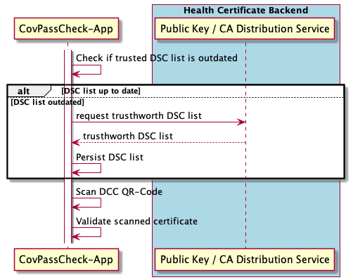

# DSC TrustList Update API

To be able to validate [Digital COVID Certificates](https://ec.europa.eu/info/live-work-travel-eu/coronavirus-response/safe-covid-19-vaccines-europeans/eu-digital-covid-certificate_en) (DCCs) from different EU countries, the national verifier apps need to retrieve a list of public keys from all possible issuing authorities. Those are called Document Signing Certificates (DSCs).
As more institutions get authorised to issue vaccination certificates, this list has to be maintained and synchronised to the verifier apps.

For an EU wide synchronisation of the list of issuing authorities, the EU commission installed a centralised service called the [EU DCC Gateway](https://github.com/eu-digital-green-certificates/dgc-gateway): a collection of REST API endpoints to upload individual DSCs as well as [fetch the latest list of all DSCs](https://eu-digital-green-certificates.github.io/dgc-gateway/#/Trust%20Lists/downloadTrustList).
Only EU Member States are allowed to access the EU Gateway (secured via mTLS), so every country must additionally provide the collection of their acknowledged DSCs via a national backend.
Bilateral exchanges are not prohibited, and private institutions (airlines, commercial verifying vendors) might request access to the national endpoint.
A removal of a DSC from the EU Gateway by a member state will be propagated to all verifier apps and is to be seen as invalidating all DCCs signed by this DSC.

This API spec defines the endpoint for the national backend that offers the list of Trusted DSCs to the verifier apps for seal verification.
A periodical request to the EU Gateway (~ every 6h) is made to fetch the latest set of all DSCs from all EU member states connected to the EU gateway.
As the national backend is public, an additional signature element is added to the overall content provided by the EU Gateway.

## Data Schema

The data structure that gets delivered looks as follows (inspired by the [COSE object](https://cose-wg.github.io/cose-spec/#rfc.appendix.C.1)):

```json
o3SWKd9PKKaQcLqc+z0F6IJAK6lxaw/B1JCWETB9EZBYgT8F/+R29+vedCO/Wkz0aXgi8SOGkXIr2rW9fEk/Jg==
{"certificates" : [
    {
        "certificateType": "DSC",
    "country": "DE",
    "kid": "qroU+hDDovs=",
    "rawData": "MIICyDCCAbCgAwIBAgIGAXR3DZUUMA0GCSqGSIb3DQEBBQUAMBwxCzAJB ... Jpux30QRhsNZwkmEYSbRv+vp5/obgH1mL5ouoV5I=",
    "signature": "o53CbAa77LyIMFc5Gz+B2Jc275Gdg/SdLayw7gx0GrTcinR95zfTLr8nNHgJMYlX3rD8Y11zB/Osyt0...W+VIrYRGSEmgjGy2EwzvA5nVhsaA+/udnmbyQw9LjAOQ==",
    "thumbprint": "aaba14fa10c3a2fb441a28af0ec1bb4128153b9ddc796b66bfa04b02ea3e103e",
    "timestamp": "2021-05-12T21:48:50.583Z",
    },
...
]}
```

- On the first line the base64 encoded signature of the contents of from the second line
- On the second line a JSON map that looks the following:

As such we provide as data structure a list of entries each representing a Document Signing Certificate (DSC - field 'rawData') along with metadata, most notably the [kid](https://github.com/ehn-dcc-development/hcert-spec/blob/main/hcert_spec.md#333-key-identifier). An overall signature on the first line ensures that this list can be guaranteed to be complete as well as integer.
The signature over the Trusted List is calculated by building the SHA-256 hash over the JSON content of the second line, then signing it via ECDSA using prime256v1.

## DGC Update / DCC Verification Flow

The high level flow for the DSC Update and DCC verification looks as follows:


As can be seen in the diagram, the request for the latest list of trusted DGCs is decoupled from the actual DCC verification, which can be done offline.
When updating the TrustedList of Document Signing Certificates (DSCs) it is important to check the authenticity and integrity  of the list via the 'signature' field.
