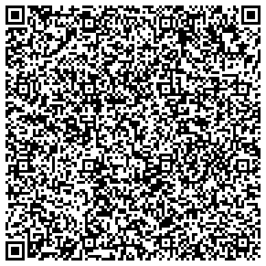

# Examples

This directory contains examples that help understand the structure of the certificates and how to use the API.

## Certificate Example and Structure

The following is an example QR code encoded according to the EU specification (created via web frontend):



The [plain text representation](01_example.txt) of the QR code content:
```
HC1:6BFOXN*TS0BI$ZD4N9:9S6RCVN5+O30K3/XIV0W23NTDEPWK G2EP4J0B3KLASMUG8GJL8LLG.3SA3/-2E%5VR5VVBJZILDBZ8D%JTQOL2009UVD0HX2JN*4CY009TX/9F/GZ%5U1MC82*%95HC2FCG2K80H-1GW$5IKKQJO0OPN484SI4UUIMI.J9WVHWVH+ZE/T9MX1HRIWQHCR2HL9EIAESHOP6OH6MN9*QHAO96Y2/*13A5-8E6V59I9BZK6:IR/S09T./0LWTHC0/P6HRTO$9KZ56DE/.QC$QUC0:GOODPUHLO$GAHLW 70SO:GOV636*2. KOKGKZGJMI:TU+MMPZ5OV1 V125VE-4RZ4E%5MK9BM57KPGX7K:7D-M1MO0Q2AQE:CA7ED6LF90I3DA+:E3OGJMSGX8+KL1FD*Y49+574MYKOE1MJ-69KKRB4AC8.C8HKK9NTYV4E1MZ3K1:HF.5E1MRB4WKP/HLIJL8JF8JF172M*8OEB2%7OREF:FO:7-WF11SKCU1MH8FWPVH%L635OBXTY*LPM6B9OBYSH:4Q1BQ:A5+I6:DQR9VKR8 BLHCFQMZA5:PHR14%GV4ZOP50$ A 3
```

Pseudo-code representation of the decoded CBOR Web Token (CWT):

- Issuer: `DE`
- Valid from: `Friday, May 7, 2021 1:09:05 PM`
- Expires: `Saturday, May 7, 2022 1:09:05 PM`

*(be aware that the CWT keys `1`, `4`, `6`, `-260` are actual integer keys in the CWT)*
```json
{
  "1": "DE",
  "4": 1651928945,
  "6": 1620392945,
  "-260": {
    "1": {
      "v": [
        {
          "ci": "01DE/00000/1119349007/BW1DDJEZX2B0VGVYII1QN7DDU#S",
          "co": "DE",
          "dn": 2,
          "dt": "2021-05-07",
          "is": "Bundesministerium für Gesundheit",
          "ma": "ORG-100030215",
          "mp": "EU/1/20/1528",
          "sd": 2,
          "tg": "840539006",
          "vp": "1119349007"
        }
      ],
      "dob": "1970-01-01",
      "nam": {
        "fn": "Dießner Musterfrau",
        "gn": "Erika Dörte",
        "fnt": "DIESSNER<MUSTERFRAU",
        "gnt": "ERIKA<DOERTE"
      },
      "ver": "1.0.0"
    }
  }
}
```

## API Usage (backend integrators)

## Preparation

In order to access parts of the API you will need an X.509 client certificate. This will be granted to authorized
integrators upon request. In the following sections we use `demo.key` for the private key, `demo.crt` for the client
certificate.

The client certificate is provided securely as a PFX file. Converting your certificate (pfx) to `demo.key` and `demo.crt`:
```shell
openssl pkcs12 -in demo.pfx -clcerts -nokeys -out demo.crt
openssl pkcs12 -in demo.pfx -nocerts -out demo.key
```

> **🔐 If you need a .p12 file, you can use openssl to convert the .pfx:**
> ```shell
> openssl pkcs12 -export -out demo.p12 -inkey demo.key -in demo.crt
> ```
> The .p12 file can also be tested with the `curl` call below:
> ```shell
> curl ... --cert-type p12 --cert demo.p12:password ...
> ```

## Certificate Issuing

For integrators (vaccination centers, patient information systems, etc.) the issuer api provides a way to send
certification requests. The following example demonstrators how to authenticate and use
the [API](../dgc-certify-api.yaml) to request a certificate for a vaccination data set:

```bash
# request a Base45 encoded certificate
curl \
  --location \
  --request POST 'https://api.certify.demo.ubirch.com/api/certify/v2/issue' \
  --key demo.key \
  --cert demo.crt \
  --header 'Accept: application/cbor+base45' \
  --header 'Content-Type: application/json' \
  --data-raw '{
      "nam": {
        "fn": "Musterfrau",
        "gn": "Erika"
      },
      "dob": "1979-04-14",
      "v": [{
        "id": "IZ999999X",
        "tg": "840539006",
        "vp": "1119305005",
        "mp": "EU/1/20/1528",
        "ma": "ORG-100001699",
        "dn": 1,
        "sd": 2,
        "dt": "2021-04-14"
      }]
    }'    
```

The result is:
```
HC1:6BFOXN*TS0BI$ZD.P9O6RZ.1LKLX97/3AOW2TCVM6K6+3R651WG%MP8*IVH53VDR%28WA1*QC3B:ZH6I1$4JN:IN1MPK95%LNF6JWEA2RIZHUP0D310TE.IS599WCK-/3O3GQH0W-2C-23/5Z17U45LQE1ZS$*S1CK9B9LGF9B9LW4G%89-8CNNE+47/GVD98-O LHG-K0C5$:O4IJZJJBY4.Z8Z.KAE1M8HVO2LFNAZ2RV4SHA-O9/IE%TE6UG+ZE V1+GO9+PGF6Z6NC8P$WA3AA9EPBDSM+Q8H4O670C57Q4UYQD*O%+Q.SQBDOBKLP64-HQ/HQ3IRE+QJDO4A7E:7LYPPTQQE2*ED.-B97U: KMZNKAS7CI*DD2IHLF95HFI1MAKJ%IH1FDLW4L4OVIOE1MA.DI1ITNP8EFDKLDD846SWKP/HLIJL8JF8JF172-KQ-K1O8N: V9NVF7HO-OH6J4SSZK2K:T14FNDMA$RN$F/W74YH DT3ZLA/DMMFI4FKPPT$M %SPPS3QQZ.142DAP3P.5FJDNBWQF7L10J5R11
```

To test this certificate, you can use [this page](https://github.pathcheck.org/debug.html) and paste the Base45
text and use the [demo signing certificate](demo-dsc.crt) certificate to verify.

## Possible Issues

- X.509 client certificate is missing or invalid
    ```
    400 Sorry, there is something invalid in your request. header is missing. X-Forwarded-Tls-Client-Cert
    ```
- X.509 client certificate is not authorized for this endpoint
    ```
    403 Sorry, the credential is invalid.
    ```
